# Expo Workshop

## What is Expo?

Expo is a framework and a platform for universal React applications. It is a set of tools and services built around React Native and native platforms that help you develop, build, deploy, and quickly iterate on iOS, Android, and web apps from the same JavaScript/TypeScript codebase. [check the docs here](https://docs.expo.io/versions/latest/)

In other words, some cool guys decided to reduce our suffering by doing all the dirty work that we had to do with the mobile native code, deploying, and building so that we can just focus on what we're trying to build using our web development knowledge.

with Expo you spend most of your time writing react code and no dealing with native source code, which is awesome, right? because we're basicly web developers so this is heaven to us!

_BUT_, the sad thing is :cry: :cry: :cry: with all this magic there is some limitations, it doesn't contain all the libraries that you might need in your project and if you need one you just can't add it! OR you can eject and lose all the magic that Expo offers you! :cry: :cry: :cry:

Anyway for most of the projects this is not a problem unless you need something related to audio or video mostly.

One last thing about how awesome Expo is; you don't need a Mac device to develop or build iOS apps :tada:

## Enough talking, Let's get to business

### Installation

#### 1. Install Expo-cli

which is the local development tool

`npm install -g expo-cli`

#### 2. Install Expo client App for iOS and Android

Yes, you have to install a mobile app from your mobile store to run your project in development mode.

> Expo client is the tool you will use to run your projects while you're developing them. When you serve your project with Expo CLI, it generates a development URL that you can open in Expo client to preview your app.

You'll know what does this mean in a sec, just hold on with me...

#### Create a new app

in your command line:

`expo init`

You are adults you can figure out what to choose now!

But I prefer the tabs option because it initialize the routes and navigation for you, and you can look at the structure of their code which can inspire you in writing your own projects later.

after that write the name of your project and wait till it finish....

#### Start the app

```
cd yourApp
yarn start
```

A new window on your browser that looks like this will appear

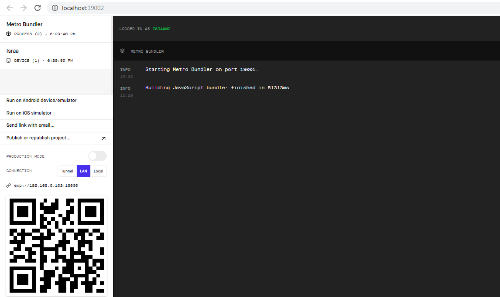

Now scan this QR code with your mobile camera and it should open the _Expo Client App_ for you!

If you got lucky and there are no ports issues then _congratulations_ you've just run your first expo app! :tada: lololeesh

If you got stuck :cry: check the docs [here](https://docs.expo.io/versions/v35.0.0/get-started/create-a-new-app/)

# Let's make something cool!

we'll make something like instagram, I don't even have an instagram account but let's build its main functionality which is uploading images and adding some description to it and browsing all the added images in the home page.

we'll be using firebase to upload images and save data and all backend stuff.

### what is firebase?

Firebase gives you functionality like analytics, databases, messaging and crash reporting so you can move quickly and focus on your users. Firebase is built on Google infrastructure and scales automatically, for even the largest apps.

Thanks to expo-cli we don't have to add firebase libraries manually into the native mobile source code! yaaay :tada:

we only need to install firebase package:

```
yarn add firebase
```

for more info about firebase check their docs [here](https://firebase.google.com/docs)

To be able to use firebase; First we need to setup a Firebase Account and create a new project then go to the projects settings and add a new web app

The Firebase console [here](https://console.firebase.google.com/u/0/) will provide you with an api key, and other identifiers for your project needed for initialization.

You're adult :older_man: :older_woman: you can find your way through firebase docs...

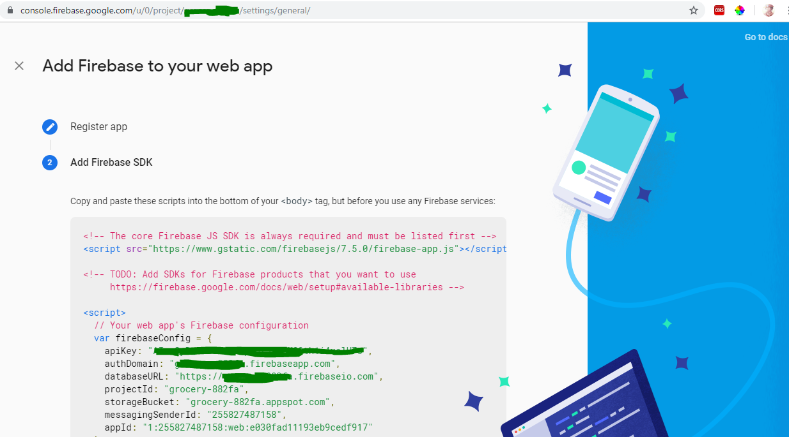

Eventually you'll need these info to have your firebase configurations ready in your app:

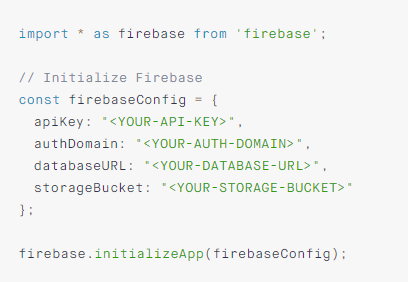

check docs [here](https://docs.expo.io/versions/v35.0.0/guides/using-firebase/#using-expo-with-firestore)

Now, we have access to all firebase functionality,

We'll be using **firestore** for storing our posts data, and **firestorage** for uploading images.

We'll be using _Context API_ to make code abstract, to reach firebase funtions from anywhere in the app,

You can check the firebase folder in this repo

Now let's set up our database in our firebase project

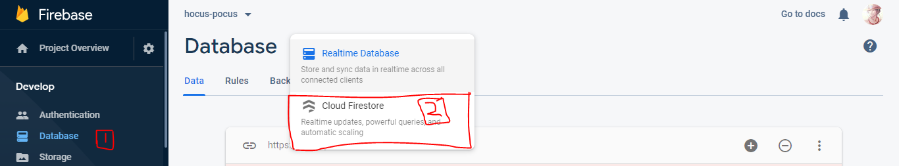
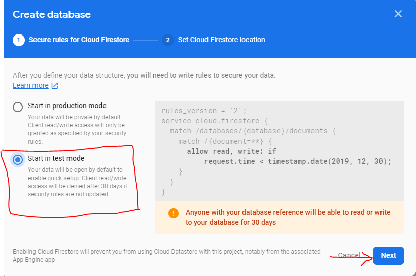
then **Done**

Now let's start a new collection which is something like a table in PSQL

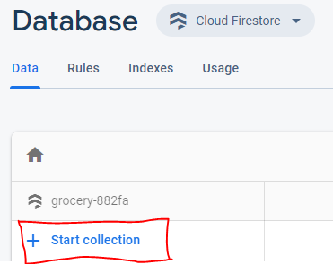

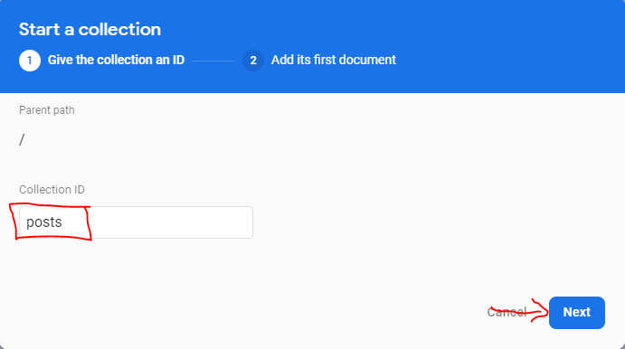

You can add data as much as you like, we'll be getting these data from our app but this is a demonstration of how data collection will look eventually  
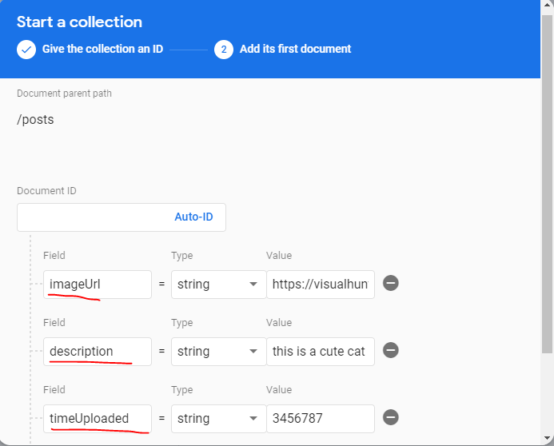

## Uploading images to firebase storage(firestorage)

Firstly, we need **ImagePicker** which is a very important component to take photos or to pick an image from phone gallery

check expo documentation on how to use this component [Expo ImagePicker Docs](https://docs.expo.io/versions/latest/sdk/imagepicker/)

Note: You also need to take a permission from the user to allow the app to use the camera or to get access to phone files.

You can easily get the uri of the image you try to upload but unfortunately this is not exactly what we need we need a BLOB which is a data format to make it easy to upload it on the web.

Now let's assume that you're awesome and a genius and you managed to get the image blob and used firebase storage API ([check uploading files to storage here](https://firebase.google.com/docs/storage/web/upload-files)) to actually upload your image into the firestorage cloud, you'd defenitly get such an error
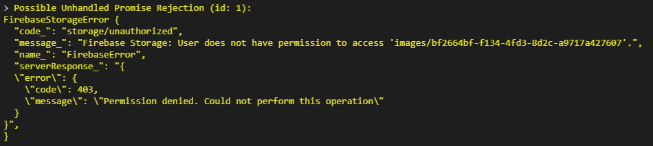

So we have to get permission first to be able to upload files into firebase storage.
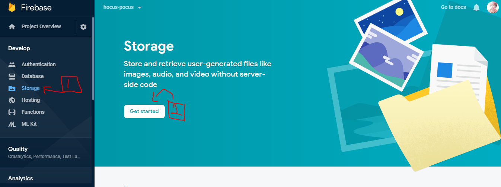

These are our storage rules, click next for now and we'll change them from somewhere else
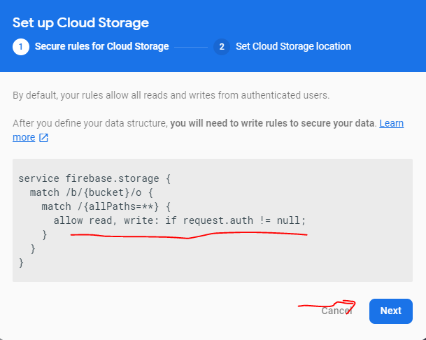
then **Done**

We have our storage ready now but it has very strict rules we need to change them!
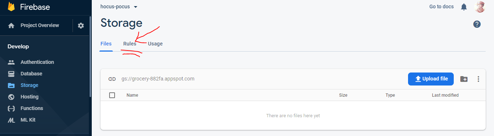

Before
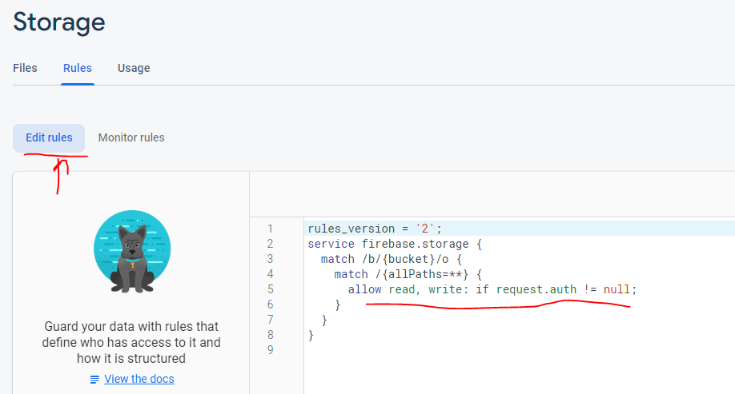

After
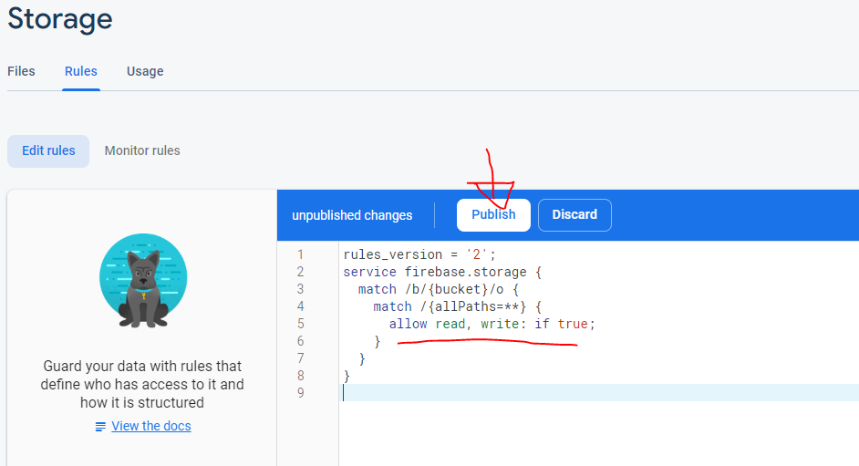
and publish these new rules changes!

I got new rules I count them :dancer:

Because I'm a good person and I know it :relieved: if you got stuck trying to implement uploading image code in your app you can check the PickImage component in this repo to see how things go,

cheat from there and pray for me :stuck_out_tongue_winking_eye:

That's it folks!

I wish you all the best luck, if you finished early try to add map feature and to get the location of the image too!

Happy coding!
